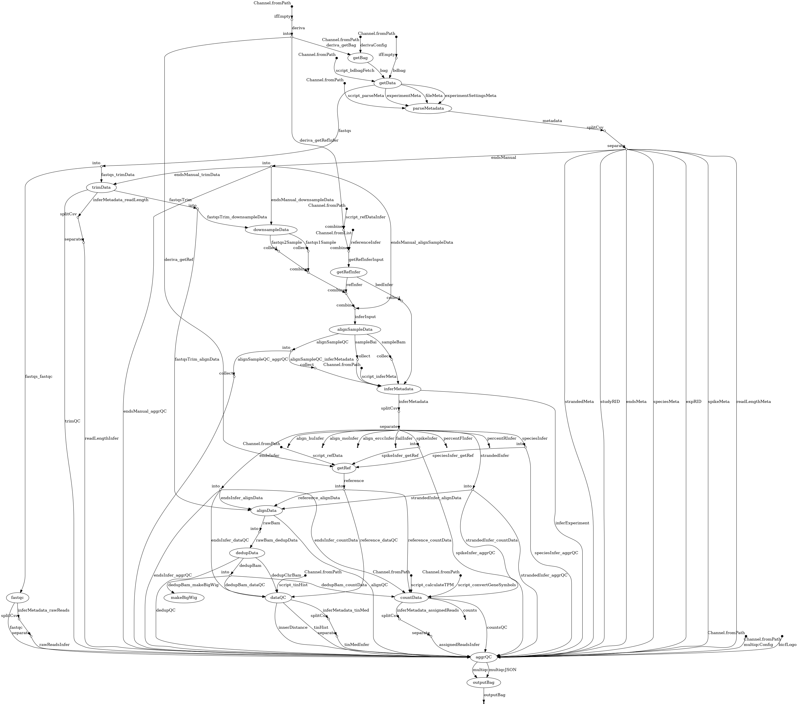

|*master*|*develop*|
|:-:|:-:|
|[](https://git.biohpc.swmed.edu/gudmap_rbk/rna-seq/commits/master)|[](https://git.biohpc.swmed.edu/gudmap_rbk/rna-seq/commits/develop)|
<!--
[]()
-->
RNA-Seq Analytic Pipeline for GUDMAP/RBK
========================================

Introduction
------------
This pipeline was created to be a standard mRNA-sequencing analysis pipeline which integrates with the GUDMAP and RBK consortium data-hub. It is designed to run on the HPC cluster ([BioHPC](https://portal.biohpc.swmed.edu)) at UT Southwestern Medical Center (in conjunction with the standard nextflow profile: config `biohpc.config`)


Cloud Compatibility:
--------------------
This pipeline is also capable of being run on AWS. To do so:
* Build a AWS batch queue and environment either manually or with [aws-cloudformantion](https://console.aws.amazon.com/cloudformation/home?#/stacks/new?stackName=Nextflow&templateURL=https://s3.amazonaws.com/aws-genomics-workflows/templates/nextflow/nextflow-aio.template.yaml)
* Edit one of the aws configs in workflow/config/
  * Replace workDir with the S3 bucket generated
  * Change region if different
  * Change queue to the aws batch queue generated
* The user must have awscli configured with an appropriate authentication (with `aws configure` and access keys) in the environment which nextflow will be run
* Add `-profile` with the name aws config which was customized

To Run:
-------
* Available parameters:
  * `--deriva` active **credential.json** file from [deriva-auth](https://github.com/informatics-isi-edu/gudmap-rbk/wiki/Uploading-files-via-Deriva-client-tools#from-a-remote-server)
  * `--bdbag` active **cookies.txt** file from [deriva-auth](https://github.com/informatics-isi-edu/gudmap-rbk/wiki/Uploading-files-via-Deriva-client-tools#from-a-remote-server)
  * `--repRID` mRNA-seq replicate RID
  * `--source` consortium server source
    * **dev** = [dev.gudmap.org](dev.gudmap.org) (default, does not contain all data)
    * **staging** = [staging.gudmap.org](staging.gudmap.org) (does not contain all data)
    * **production** = [www.gudmap.org](www.gudmap.org) (***does contain  all data***)
  * `--refMoVersion` mouse reference version ***(optional)***
  * `--refHuVersion` human reference version ***(optional)***
  * `--refERCCVersion` human reference version ***(optional)***
  * `-profile` config profile to use ***(optional)***:
    * defaut = processes on BioHPC cluster
    * **biohpc** = process on BioHPC cluster
    * **biohpc_max** = process on high power BioHPC cluster nodes (=> 128GB nodes), for resource testing
    * **aws_ondemand** = AWS Batch on-demand instant requests
    * **aws_spot** = AWS Batch spot instance requests
* NOTES:
  * once deriva-auth is run and authenticated, the two files above are saved in ```~/.deriva/``` (see official documents from [deriva](https://github.com/informatics-isi-edu/deriva-client#installer-packages-for-windows-and-macosx) on the lifetime of the credentials)
  * reference version consists of Genome Reference Consortium version, patch release and GENCODE annotation release # (leaving the params blank will use the default version tied to the pipeline version)
    * *current mouse* **38.p6.vM22** = GRCm38.p6 with GENCODE annotation release M22
    * *current human* **38.p6.v31** = GRCh38.p12 with GENCODE annotation release 31
* ***Optional*** input overrides
  * `--inputBagForce` utilizes a local replicate inputBag instead of downloading from the data-hub (still requires accurate repRID input)
    * eg: `--inputBagForce test_data/bagit/Replicate_Q-Y5F6.zip` (must be the expected bagit structure)
  * `--fastqsForce` utilizes local fastq's instead of downloading from the data-hub (still requires accurate repRID input)
    * eg: `--fastqsForce 'test_data/fastq/small/Q-Y5F6_1M.R{1,2}.fastq.gz'` (note the quotes around fastq's which must me named in the correct standard [*\*.R1.fastq.gz and/or \*.R2.fastq.gz*] and in the correct order)
* Tracking parameters ([Tracking Site](http://bicf.pipeline.tracker.s3-website-us-east-1.amazonaws.com/)):
  * `--ci` boolean (default = false)
  * `--dev` boolean (default = false)

FULL EXAMPLE:
-------------
```
nextflow run workflow/rna-seq.nf --deriva ./data/credential.json --bdbag ./data/cookies.txt --repRID Q-Y5JA
```

To run a set of replicates from study RID:
------------------------------------------
Run in repo root dir:
* `sh workflow/scripts/splitStudy.sh [studyRID]`
It will run in parallel in batches of 25 replicatesRID with 30 second delays between launches.\
NOTE: Nextflow "local" processes for all replicates will run on the node/machine the bash script is launched from... consider running the study script on the BioHPC's SLURM cluster (use `sbatch`).


<hr>
[**CHANGELOG**](https://git.biohpc.swmed.edu/BICF/gudmap_rbk/rna-seq/blob/develop/CHANGELOG.md)
<hr>

Credits
=======
This workflow is was developed by [Bioinformatic Core Facility (BICF), Department of Bioinformatics](http://www.utsouthwestern.edu/labs/bioinformatics/)

PI
--
Venkat S. Malladi\
*Faculty Associate & Director*\
Bioinformatics Core Facility\
UT Southwestern Medical Center\
<a href="https://orcid.org/0000-0002-0144-0564" target="orcid.widget" rel="noopener noreferrer" style="vertical-align:top;">orcid.org/0000-0002-0144-0564</a>\
[venkat.malladi@utsouthwestern.edu](mailto:venkat.malladi@utsouthwestern.edu)


Developers
----------
Gervaise H. Henry\
*Computational Biologist*\
Department of Urology\
UT Southwestern Medical Center\
<a href="https://orcid.org/0000-0001-7772-9578" target="orcid.widget" rel="noopener noreferrer" style="vertical-align:top;">orcid.org/0000-0001-7772-9578</a>\
[gervaise.henry@utsouthwestern.edu](mailto:gervaise.henry@utsouthwestern.edu)

Jonathan Gesell\
*Computational Biologist*\
Bioinformatics Core Facility\
UT Southwestern Medical Center\
<a href="https://orcid.org/0000-0001-5902-3299" target="orcid.widget" rel="noopener noreferrer" style="vertical-align:top;">orcid.org/0000-0001-5902-3299</a>\
[johnathan.gesell@utsouthwestern.edu](mailto:jonathn.gesell@utsouthwestern.edu)

Jeremy A. Mathews\
*Computational Intern*\
Bioinformatics Core Facility\
UT Southwestern Medical Center\
<a href="https://orcid.org/0000-0002-2931-1430" target="orcid.widget" rel="noopener noreferrer" style="vertical-align:top;">orcid.org/0000-0002-2931-1430</a>\
[jeremy.mathews@utsouthwestern.edu](mailto:jeremy.mathews@utsouthwestern.edu)

Please cite in publications: Pipeline was developed by BICF from funding provided by **Cancer Prevention and Research Institute of Texas (RP150596)**.

<hr>
<hr>

Pipeline Directed Acyclic Graph
-------------------------------

